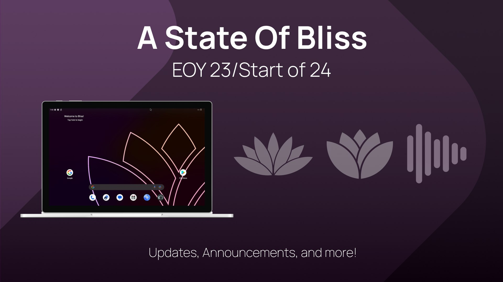
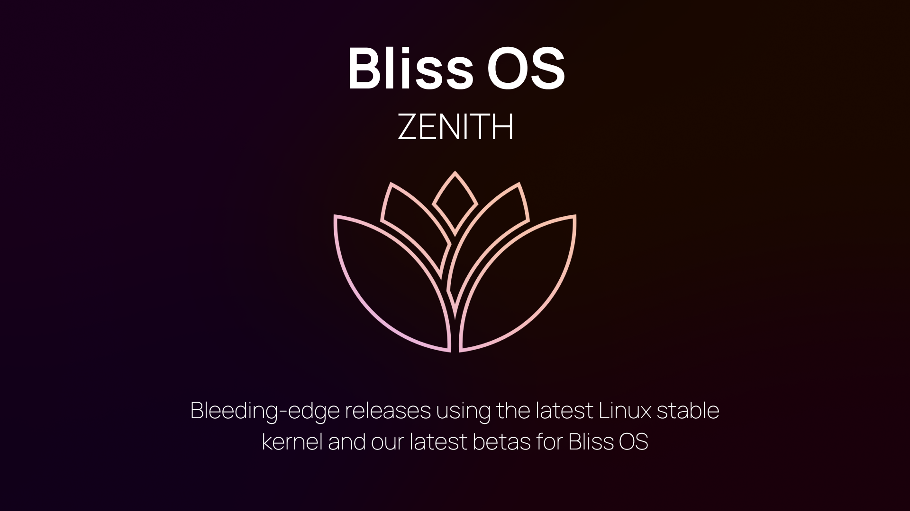

# A State Of Bliss : Wrapping up a Blissful year - Last Quarter of 2023 (and beginning of 2024)

It is that time of the year to share and look forward to the future, so we are back with another update on what all we have been up to and where we are headed from here.

Leading Up To Now

We have been working on merging upstream changes, our install process, our update process, and adding more features and configuration options to Bliss OS, and much of that work is getting ready for release.

## A revamped bootable installer

While there are many reports that the bootable installer was really buggy in recent years, because there are alternatives like Grub2Win or manual Linux dual-boot setup we haven’t spent much time on it. However, with the shocking discover that Grub2Win, a project that we and many people are using to install and dual-boot BlissOS [is doing something inappropriate](https://twitter.com/blissos_org/status/1700613048518795683) , we realized that it’s time and decide to look back at our bootable installer to completely revamped it :

* Both the installer and the initrd now will use latest busybox 1.36.1 built by Docker ([https://github.com/docker-library/busybox](https://github.com/docker-library/busybox))
* Almost all of the libraries & programs are now using prebuilts from Debian 13 i386 instead of the old one from Android-x86 (which was taken from an old version of Fedora).
* efivar and efibootmgr are still being built from source, but are being updated to latest versions.
* Grub has been bumped to Grub 2.06 for both Legacy BIOS or UEFI. Bumping Grub2 to the latest stable version also helps **fixing black screen issues when trying to install**.
* Support installing with exFAT or F2FS (experimental).
* UEFI users can now be able to manually choose the ESP (EFI System Partition) if they want, this is for people who have multiple ESP in their setup or just want to make sure that the installer picks the correct partition. We also allow users to change the label on the folder or on the UEFI entry if you want more customization.
* Some label and text edit for better comprehensiveness of what the installer tries to do.
* Support install with rEFInd for UEFI users, it is still in the experimental stage so please consider carefully before choosing it.
* Using rsync for the files copy stage as it can fix an annoying problem that the progress bar will reach 200% when done.

We believe that with these new changes, users will have a great experience setting up the OS. Just a small caution : Unlike Android-x86, we haven’t planned to support Secure Boot yet so please disable it before trying to install the OS.

Check out the screenshot here if you are interested : https://t.me/hmdumbground/111

## An approach to OTA updates on BlissOS

A few months ago, we reached out to [@erfanoabdi](https://github.com/erfanoabdi) for a solution to OTA updates. This was intended for Bliss Co-Labs clients and later applied to BlissOS and it is unlike any other OTA method that any Android-x86 or other derivative used to use. The idea here is utilizing virtual A/B by making a bootctrl HAL that will edit Grub configuration to switch between the two slots. The advantage is that with virtual A/B, users can still be able to use the OS while it’s updating because the update is being handled in another slot. Also other custom ROMs can easily use our method as the update is being handled by LineageUpdater, which is being used by many.

The disadvantages that we observed is that this method does not support filesystems that are handled by [FUSE](https://www.kernel.org/doc/html/next/filesystems/fuse.html) , so if you install BlissOS on an NTFS partition, you will not be able to use it. Another issue is that because switching slot is to edit a config file, manual Linux dual-boot will now have to take extra steps if you want OTA support. We will soon update it in our Documentation.

All versions that we are maintaining will support OTA. This includes BlissOS 14, 15 and 16. Please install the new builds to get the latest OTA updates in the future.

## AV1 support for ffmpeg codecs

Thanks to the work of [@KonstaKANG](https://konstakang.com/), we’ve been able to bring AV1 support into our ffmpeg codecs. Currently AV1 is being handled by [libdav1d](https://code.videolan.org/videolan/dav1d) made by the developers at VLC and being built using [GloDroid’s AOSPExt](https://github.com/GloDroid/aospext). We are also planning to support VA-API AV1 soon for hardware-accelerated solution.

## Properly handle suspend

While making her first big contribution to the project which is providing fixes to the Steam Deck, our friend [@Kethen](https://github.com/Kethen) has decided to help us tackle the suspend issue. Suspending the machine or waking it up now feels less buggy than before.

## BlissOS Go for all versions

Announced in June with only 15 (Android 12L) versions, BlissOS Go is still being continued to develop and now we are announcing that the Go version will be available to all BlissOS versions, including 14, 15 and 16 with both Gapps or FOSS variants.

## Bump to kernel 6.1 for all builds

Kernel 6.1 has been tested internally and is available on BlissOS 16 for a while now and we decided to finally release all of our BlissOS versions with it. Still the same combination of Google’s Android common kernel source + Android-x86 patches + some xanmod patches. Now with more hardware supported especially the Steam Deck with some drivers & fixes being pulled directly from Valve.

## Introducing BlissOS Zenith

We realized that there are users out there who are using hardware that are too new for the kernel in BlissOS to support. This is a challenge as we know that we can’t just build all the current BlissOS versions with stable or mainline kernel, that would risk the stability of the OS. So we’ve decided that we will make another variant, this time with 2 key differences :

* Only build the latest version of BlissOS available for this variant, so for now it’s 16.
* Using stable branch of the linux kernel.

We want to make this build for users that have new hardware or the one that always wants the latest, latest version of BlissOS and the latest kernel. With that said, we still need a name for this new variant. This gave us an idea, “What if we ask our community ?” and decide to ask people to give this new build a name on our [Twitter](https://twitter.com/blissos_org/status/1733872766133403666)  & our group chat. After looking through all the suggestions, we’ve decided to choose `Zenith` .

 \
BlissOS Zenith, The new flagship build of BlissOS, intended for "chasing the latest". Starting now with version 16.9.4 and kernel 6.6

## Other updates

* A lot of fixes for Steam Deck, even a dedicated sensor HAL thanks to [@Kethen](https://github.com/Kethen) (again).
* alsa-info.sh is now being included into BlissOS, this will generate a file with all the necessary information related to audio, this is intended to debug audio issues.
* [sof-firmware](https://github.com/thesofproject/sof-bin) from Intel is being included to support more audio hardware.
* All builds are now using Mesa 23.3.3
* Some fixes to the sensors HAL (thanks to [@Kethen](https://github.com/Kethen) again)
* Fixed an issue that desktop Nvidia GPUs with nouveau can’t be able to get into the GUI.
* Support KeeTouch touchscreens.
* Rotation quirks for Chuwi Ubook X 2023
* Extra properties to disable navbar, statusbar, taskbar and recents for BlissOS 15 & 16. This used to be a part of Bliss-Bass and has now been ported to BlissOS.
* Users can now fix their audio issues after install by putting their hardware’s alsa state definitions in `/data/vendor/alsa/<hardware>.state`
* Updated KernelSU to latest version.
* **Virtual Console is back**, you can now press Ctrl + Alt + F1 to switch to it. If you want to unlock the console, add `androidboot.enable_console=1` to the cmdline. Bringing a virtual console also helps fixing another issue: hiding a small blinking cursor when using software rendering.
* Some tweaks for BlissOS Go taken from [GloDroid Project](https://github.com/GloDroid) .
* You can now disable the tablet taskbar on BlissOS 15 & 16. Patches were taken from [LMODroid](https://github.com/LMODroid) .
* [AutoFast JNI](https://web.archive.org/web/20220625232751/https://01.org/blogs/2019/intel-optimizations-android-pie-runtime-compiler) is now available on BlissOS 16.
* BlissOS 15 and 16 now have a new Sleep logo, and you can enable/disable the button on Blissify Settings => Power Menu

