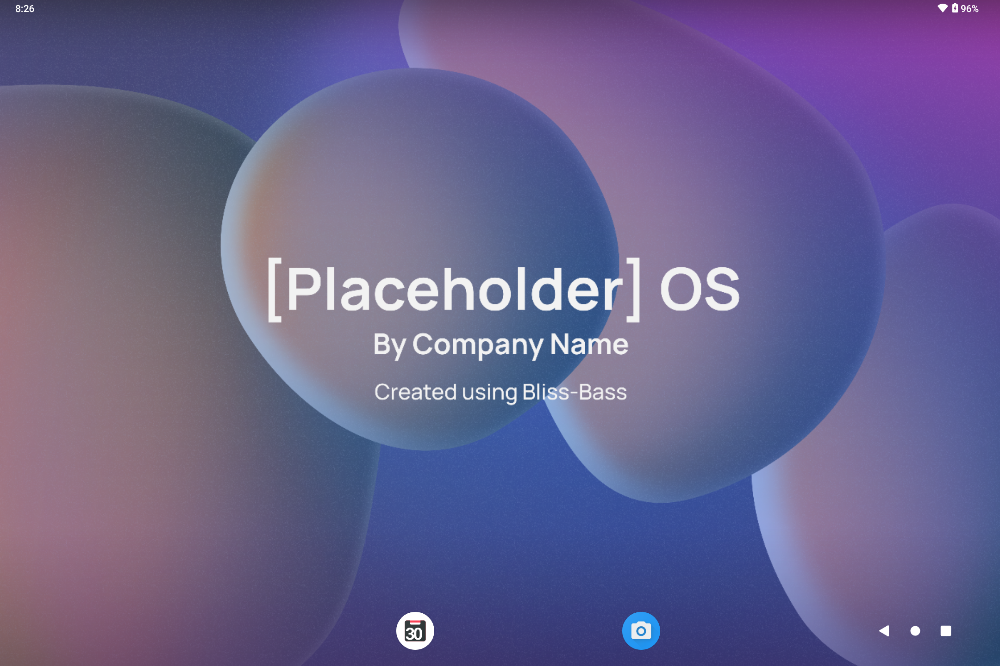

# Development Progress

Since the release of our stable Bliss OS 14.x & 15.x builds, we have had the chance to make a number of advancements on the OS in various areas. We will start the post with the updates coming from the value added contributions on the business side of things, then end with the updates being merged into the Bliss OS builds. 

## Bliss Bass - beta builds started already

We have started to push some of the source for our Bliss Bass (Broad Apparatus Support System) builds that we use for customer focused builds based on Bliss OS, and the feedback from that has been pushing our development on the platform in a positive direction. These builds will be 100% ready for use in products, and will come with a number of added configuration options for features, UI/UX, updates, and more. We have released a few beta builds of the base FOSS variant of Bliss Bass for testing on Sourceforge. The initial flavors we will offer are:

* Kiosk variant
* Desktop variant
* Tablet variant
* Tablet Go - IOT/IIOT variant
* More on its way

There will be a new website created for these builds, and they will still be free to download and test, although the initial test builds will come watermarked. This will ensure that we are able to produce these test builds for the public while still retaining our licensing rights for it. 

We are still collecting valuable information from our customers and would love to hear what our users think of this approach. Please leave a comment and let us know your thoughts. 

# Bliss OS Updates

There are a few important changes that we are gearing up for on Bliss OS. First, on Bliss OS 14.x & 15.x, we will be shipping with Kernel 6.1, this includes our Surface builds. Second change will be for BlissOS 14.x, 15.x & 16.x (Generic/Surface), and that will be a switch to a new Audio HAL made by Intel’s Project Celadon

Switching to the new Audio HAL will be an important change for us, so we would like to ask everyone to help us to test these new HAL so that we can have feedback and improve it further.

Please join our Discord or Telegram to gain access to the new test builds of BlissOS 15.8.8 with Kernel 6.1.36 and the new Audio HAL.

## Go builds & Low RAM devices can now bypass some options in Settings

In BlissOS Go builds, there are some options that are being blocked by Android. Most notably the option to allow apps to draw on other apps. You will see this text when you are trying to grant the permission :

With the latest update of BlissOS, we've included a switch in Blissify Settings to allow bypassing this restriction. So now you are able to use apps like Smart Dock or Taskbar just like the usual generic version. The new option will be available in all of the upcoming BlissOS releases including 14, 15 and 16.

## A/B OTA Updates - rolling out soon

Our efforts on Bliss Co-Labs have been paying off and we have a number of features and options developed from there heading to our open-source Bliss OS builds soon. The recently merged changes for the Bliss Setup Wizard for Bliss OS 15.x is one of those. 

The other will be coming in the form of OTA updates for Bliss OS. These updates will bring the following improvements to the system:

* Separate A/B slots for all three images (system.img, initrd.img & kernel)
* System Rollbacks - Native bootctrl behavior
* Update server controlled by our own [Shipper Stack](https://github.com/shipperstack)

But there is one major downside that we would like to address, with the new OTA feature we won't be able to ship the system image with any other type of images other than system.img. Meaning that there will be no more system.sfs (system.img inside a SquashFS image) or system.efs (system.img inside a EROFS image). We will have to ship with a system.img that is using SquashFS or EROFS instead.

So, what will this affect you ? Usually on BlissOS or Android-x86 in general, we build the system.img in EXT4, but then we put it inside system.sfs to make the image lighter because of SquashFS compression. And then if you want the system to be in read-write because it's EXT4, you can just extract system.sfs out, easy as that. However, the new OTA changes came with a challenge that restricted us to only build system.img, giving us no choice but to initially not build it with SquashFS or EROFS. We have since worked around those issues, but the early beta builds might not have all those fixes included just yet.

## Grub updates to v2.06 - also rolling out soon

Now that we have the groundwork laid out for updating Grub with our A/B OTA updates, we decided it was best to update to the current version of Grub that Linux uses, and in doing so, we also solve an issue that 12th gen+ Intel CPU’s have had where the screen is black after selecting any boot option from Grub. This means that the most recent gen CPU’s will now be supported by both the kernel and the bootloader for Bliss OS. 

This effort came from a few different contributors, so we have an initial solution we will likely release, and then split the other contributions into phases where we merge binary updates, libraries, modules, installer updates, and others separately in order to ensure stability as we move forward. 

## OEM Install mode options - also rolling out soon

Bliss OS builds (and Android-x86)  have had some major issues with the auto-install mode that have been the source of many headaches and many long nights of reinstalling other operating systems in order to correct. So we took some time to update the current auto-install solution and give it a more proper name of OEM install, along with adding a few more options for unattended installation (Force):

* OEM Install (same as old auto-install, will require some interaction)
* OEM Install - Force MBR [Unattended Install] (if bios is set to use Legacy)
* OEM Install - Force EFI [Unattended Install] (if bios is set to use UEFI/EFI)
* OEM Install - Force [Unattended Install] (autodetect MBR/EFI)
* OEM Update - Will auto-update a previous default install or OEM install

These modes are intended for factory setup and will not work with devices that come with Windows unless you wipe all partitions except for EFI and leave a second OS partition with all the remaining space. 

## We have more on the way

We don’t want to spoil any of the surprises we have planned, so we will leave things here for this post. Just know that there will be a lot of contributions heading towards Bliss OS source, coming from the efforts of Bliss Co-Labs’ and the community in helping bring our project even further than we ever thought possible. 

Thanks again and enjoy the builds!
